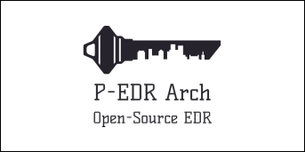

	

  
  # What is this project?
  
**P-EDR Arch** is a free and _open-source_ personal solution which focus is to be used in small and medium companies. It provides high flexibility, integration with new technologies and configurability. 
  
It uses a set of technlogies from known brands and projects, like _Microsoft_ and _TheHive Project_, which are in constant updating, so it means that this architecture provides a long-life product life-cycle.
  
Additionally, it has followed as a methodology, the contents replied in ISO/IEC-27034-3:2018.
  
  # Why?
