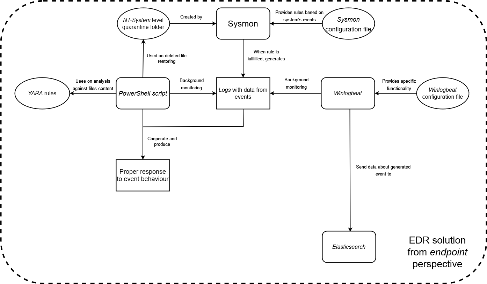
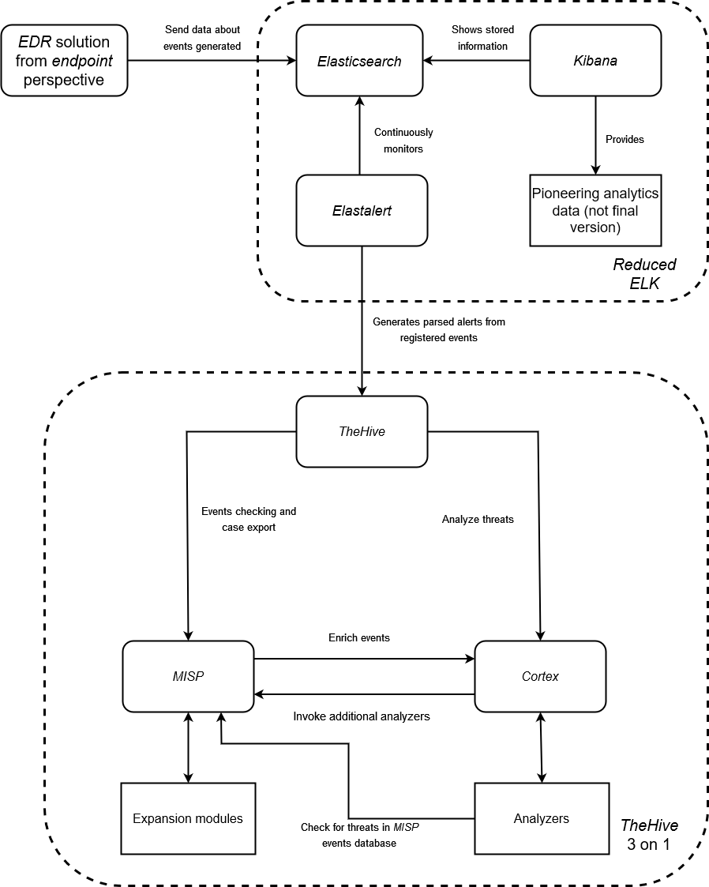

	

 # Motivation
  
  ## What is this project?
  
**P-EDR Arch** is a free and _open-source_ personal solution which focus is to be used in small and medium enterprises (SRE). It provides high flexibility, integration with new technologies and configurability. 
  
It uses a set of technologies from known brands and projects, like _Microsoft_ and _TheHive Project_, which are in constant updating, so it means that this architecture provides an extremely long product life-cycle.
  
Additionally, it has followed as a methodology, the contents that appear in ISO/IEC-27034-3:2018, a pretty much well-known standard which gives indicators to use for good practices in the crafting of application security management process.
  
  ## Why?

There are a lot of EDR solutions available to **BUY**, but these solutions are out of the economic scope for a lot of companies that have some type of infraestucture available to the Internet. Besides these organizations incorporate some type of traditional or next-generation antiviruses, with the objective of protecting their systems, more sophisticated _malware_ (like for example, _ransomware_) can pass through these defenses, compromising sensible information of clients and the company itself. In other words, if that situation happens, that would mean a serious impact from a reputational and economic point of view, which can lead to the closure if said impact is unmanageable.

**All companies should have the choice of integrating some kind of EDR solution into their systems.**

P-EDR Arch provides all the tools needed with the purpose of implementing an EDR solution to any user or company that wants it.

 # Features
 
 - Free and _open-source_ EDR for _Windows_.
 - Detection to events via _Sysmon_ rules.
 - Active response to events via _self-script_.
 - Send data from all _endpoints_ to centralized _Kibana_ instance.
 - Generate alerts from _Kibana_ to _TheHive_.
 - Obtain more information from attacks thanks to _Cortex_.
 - Share information about an attack from your SOC to other companies via _MISP_.
 - Everything in the provided architecture can be modified to gratify company's interests.
	
# What it uses?
 - _Sysmon_, for detecting threats.
 - _PS script_, for active response.
 - _YARA rules_, for file/executable analysis.
 - Quarantine folder with ACL protection, for malicious files deleted by the system and legitimate files deleted by malicious files.
 - _Winlogbeat_, for sharing event data.
 - _Elasticsearch_, for storing events data.
 - _Kibana_, for checking events registered.
 - _Elastalert_, for generating alerts to sharing incident response platform (SOC).
 - _TheHive_, for registering alerts and SOC analysis.
 - _Cortex_, for producing extra informating related to alert's observables (IP, hashes, etc).
 - _MISP_, for sharing _malware_ information with other enterprises.

**Every single element is _open-source_ and can be hand-configured**.

# How it works
 
 

	
 
 

 	
 
 **NB:** These are the mandatory components for the purpose of the EDR to work, which means the architecture is highly flexible (e.g: adding _Cuckoo_ to the _endpoint_ part for sandboxing tasks).

# Related work

- _Sysmon X_: https://github.com/marcosd4h/sysmonx
- _Comodo Open Source EDR_ with user and kernel components: https://github.com/ComodoSecurity/openedr
- _Whids_ Open Source _EDR_ for _Windows_: https://github.com/0xrawsec/whids
- _Sysmon_ based EDR written in _Powershell_ (and main inspiration for this project): https://github.com/ion-storm/sysmon-edr
